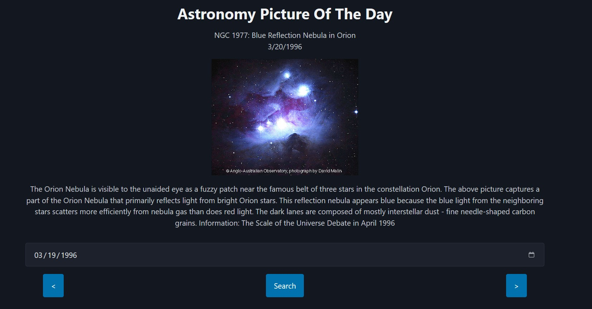

# Astronomy Picture of the Day
Simple Page to display the astronomy picture of the day from NASA.

## Set Up:
- Replace 'YOUR_API_KEY' in functions.js with your API key from NASA website. Then open the index.html page in your favorit browser. 

## Images:

